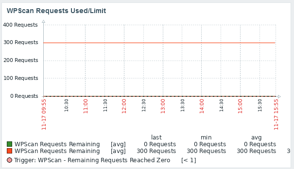
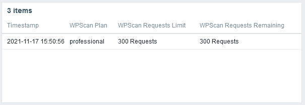

# Zabbix_WPScanAPIStatus
Zabbix WPScan API Status Template to Monitor API usage

## Requirements
Built on Zabbix 5.4.  May work on other versions.

## Background
This template is used to monitor and alert on WPScan API usage using the WPScan API status.  

## Installation
- Import Template (zabbix_wpscan_api_status)
- Create a host "WPScan API"
  - Add an agent interface (necessary, but unused)
  - Assign the "WPScan API Provider" template
  - Update Macro, {$WPScan_API} to the API token from WPScan
  - Save

## Methodology
The template uses an HTTP agent item to set a parent data item.  Dependent items are then set from the parent.  Triggers are attributed to the dependent items.

## Triggers
- API Plan Change
- Limit Change
- 50% Limit Remaining
- 10% Limit Remaining
- 0 Requests Remaining

## Tags
- Application:WPScan
- Application:API
- API:WPScan
- WPScan:Data (API JSON Data Source)
- WPScan:Remaining (API Credits Remaining)
- WPScan:Used (API Credits Used)
- WPScan:Allowance (API Credits Allowed)
- WPScan:Account (account information)

## WebScenarios
- API Endpoint Check

## Graphs
- WP Scan API Credits Remaining
- WP Scan API Credits Used
- WP Scan API Credits Used/Limit

## Screenshots

### Host Data

### Triggers

### Dashboard - WPScan Credits Used/Limit

### Dashboard - Account Information 

## Updates
- Nov 17 2021: added screenshots, added export format, added tags

## License
Apache 2

## Contact
@krelkci (twitter) @relkci (github)  

## Thanks
Black Hills Information Security https://www.blackhillsinfosec.com